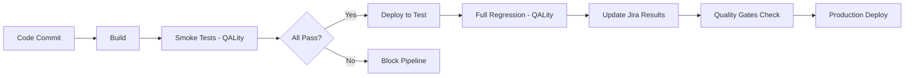

# Integração com QALity e Jira - Guia de Configuração

**Autor**: Bruno Custodio de castro silva
**Data**: Outubro 2025  
**Versão**: 1.0

## 📋 Visão Geral

Este guia detalha como integrar os testes do ServeRest com QALity para execução e rastreamento no Jira, conforme solicitado no challenge.

---

## 🎯 Objetivos da Integração

### Benefícios Esperados
- ✅ **Rastreabilidade completa** dos testes no Jira
- ✅ **Execução organizada** através do QALity
- ✅ **Relatórios consolidados** de qualidade
- ✅ **Histórico de execução** mantido automaticamente
- ✅ **Integração com processo** de desenvolvimento

### Fluxo de Trabalho
```
Planejamento (Jira) → Execução (QALity) → Resultados (Jira) → Análise (Dashboards)
```

---

## 🛠️ Configuração Inicial

### Pré-requisitos
- [ ] Acesso ao Jira da organização
- [ ] Plugin QALity instalado no Jira
- [ ] Permissões para criar/executar testes
- [ ] Projeto no Jira configurado

### Estrutura no Jira
```
📁 Projeto: ServeRest API Tests
├── 📋 Epic: Challenge Testes API
├── 📝 Stories: Funcionalidades por módulo
│   ├── 🔐 Login e Autenticação
│   ├── 👤 Gerenciamento de Usuários  
│   ├── 🛒 Gerenciamento de Produtos
│   └── 🛍️ Carrinho de Compras
└── 🧪 Test Cases: Casos de teste detalhados
```

---

## 📝 Criação de Test Cases no QALity

### Template de Test Case

#### Informações Básicas
| Campo | Exemplo | Observações |
|-------|---------|-------------|
| **Summary** | CT-001: Login com credenciais válidas | Usar ID do caso de teste |
| **Project** | ServeRest API Tests | Projeto configurado |
| **Test Type** | Manual / Automated | Definir tipo |
| **Priority** | High / Medium / Low | Baseado na criticidade |
| **Component** | Auth, Users, Products, Cart | Módulo da API |
| **Labels** | api, smoke, boundary, critical | Tags para filtros |

#### Descrição Detalhada
```markdown
**Objetivo:**  
Validar que usuário consegue fazer login com credenciais válidas

**Pré-condições:**
- API ServeRest disponível  
- Usuário cadastrado no sistema

**Regras de Negócio:**
- RN-001: Token JWT válido por 600 segundos
- RN-002: Validação de credenciais obrigatória

**Dados de Teste:**
Email: admin@teste.com
Password: senha123
```

#### Steps (Passos)
| Step | Action | Expected Result |
|------|--------|----------------|
| 1 | Abrir Postman e configurar request POST /login | Request configurado |
| 2 | Inserir credenciais válidas no body | JSON formatado corretamente |
| 3 | Executar request | Status 200 OK |
| 4 | Validar response | Contém message e authorization |
| 5 | Verificar formato do token | Inicia com "Bearer " |

---

## 🚀 Processo de Execução com QALity

### 1. Criação de Test Plan
```markdown
**Nome:** ServeRest API - Sprint X - Regression
**Descrição:** Execução completa dos testes de regressão da API ServeRest
**Tipo:** Manual Testing / Automated Testing
**Ambiente:** https://serverest.dev
**Período:** [Data início] - [Data fim]
```

### 2. Seleção de Test Cases
- **Por Labels**: `smoke`, `critical`, `boundary`
- **Por Component**: `auth`, `users`, `products`, `cart`  
- **Por Priority**: `High` → `Medium` → `Low`

### 3. Execução Estruturada
```
📋 Test Plan: ServeRest Regression v2.0
├── 🔥 Smoke Tests (30 min)
│   ├── CT-001: Login válido ✅
│   ├── CT-005: Cadastrar usuário ✅  
│   └── CT-010: Cadastrar produto ✅
├── 🧪 Functional Tests (60 min)
│   ├── CT-002: Login inválido ✅
│   ├── CT-006: Email duplicado ❌ BUG-001
│   └── CT-015: Boundary estoque ✅
└── 🔗 Integration Tests (45 min)
    ├── CT-018: Fluxo completo ✅
    └── CT-016: Finalizar compra ✅
```

---

## 📊 Rastreamento e Métricas

### Dashboards Recomendados

#### 1. Dashboard de Execução
```sql
-- Filtros sugeridos para Jira Query Language (JQL)
project = "ServeRest" AND component in (auth, users, products, cart)
AND "Test Execution Status" in (PASS, FAIL, BLOCKED)
AND created >= -30d
```

#### 2. Métricas de Qualidade
| Métrica | Fórmula | Meta |
|---------|---------|------|
| **Pass Rate** | (Passed / Total) * 100 | >95% |
| **Execution Coverage** | (Executed / Planned) * 100 | 100% |
| **Bug Density** | Bugs Found / Tests Executed | <5% |
| **Avg Execution Time** | Total Time / Tests Executed | <2 min/test |

#### 3. Trends por Sprint
- Taxa de sucesso ao longo do tempo
- Número de bugs encontrados por severidade
- Cobertura de teste por módulo
- Tempo de execução por tipo de teste

---

## 🐛 Gestão de Defeitos Integrada

### Fluxo de Bug Report
```
Teste Falha (QALity) → Criar Bug (Jira) → Link Automático → Rastreamento
```

### Template de Bug no Jira
| Campo | Valor | Fonte |
|-------|-------|-------|
| **Issue Type** | Bug | Padrão |
| **Summary** | [Resumo do problema] | Manual |
| **Description** | [Detalhes + evidências] | QALity |
| **Environment** | https://serverest.dev | Automático |
| **Test Case** | Link para CT-XXX | QALity |
| **Priority** | High/Medium/Low | Baseado no impacto |
| **Component** | Auth/Users/Products/Cart | Do test case |
| **Labels** | api-bug, regression | Automático |

### Campos Customizados
- **Test Execution ID**: Link para execução no QALity
- **API Endpoint**: Endpoint específico com problema  
- **Request/Response**: Dados técnicos do erro
- **Business Impact**: Impacto na funcionalidade

---

## 📈 Relatórios e Análise

### Relatório de Execução (Semanal)
```markdown
# Relatório de Execução - Semana XX/2025

## 📊 Resumo Executivo
- **Tests Planned:** 45
- **Tests Executed:** 43 (96%)  
- **Pass Rate:** 91% (39/43)
- **Bugs Found:** 4 (1 High, 2 Medium, 1 Low)

## 📋 Por Módulo
### 🔐 Authentication (100% pass)
- 8/8 testes executados
- 0 bugs encontrados
- Tempo médio: 1.2 min/teste

### 👤 Users (88% pass) 
- 12/12 testes executados  
- 2 bugs encontrados (BUG-001, BUG-002)
- Tempo médio: 1.8 min/teste

## 🎯 Próximos Passos
- Corrigir BUG-001 (crítico)
- Re-executar testes que falharam
- Incluir novos boundary tests
```

### KPIs de Qualidade
```javascript
// Exemplo de query para dashboard
{
  "title": "API Test Quality Dashboard",
  "widgets": [
    {
      "type": "pie_chart", 
      "title": "Test Results",
      "query": "testExecution.status",
      "data": ["PASS", "FAIL", "BLOCKED"]
    },
    {
      "type": "line_chart",
      "title": "Pass Rate Trend", 
      "query": "passRate over time",
      "period": "weekly"
    },
    {
      "type": "bar_chart",
      "title": "Bugs by Severity",
      "query": "bug.severity where source='API Tests'"
    }
  ]
}
```

---

## 🔄 Integração com Processo de Desenvolvimento

### Pipeline de Qualidade


### Critérios de Release
- [ ] 100% smoke tests passing
- [ ] >95% regression tests passing  
- [ ] 0 critical bugs open
- [ ] All test executions documented in Jira
- [ ] Quality metrics within acceptable range

---

## 🛠️ Automação e Integração

### Integração Newman + QALity
```bash
#!/bin/bash
# Script de integração Newman com QALity

# Executar testes Postman
newman run ServeRest.postman_collection.json \
  --environment env.json \
  --reporters cli,junit \
  --reporter-junit-export results.xml

# Upload resultados para QALity (API)  
curl -X POST "https://jira.company.com/rest/qality/1.0/execution" \
  -H "Authorization: Bearer $JIRA_TOKEN" \
  -F "testPlan=$TEST_PLAN_ID" \
  -F "results=@results.xml"
```

### Webhook de Notificação
```json
{
  "webhook_url": "https://jira.company.com/webhooks/test-execution",
  "events": ["test.completed", "test.failed"],
  "payload": {
    "testId": "{{testId}}",
    "status": "{{status}}", 
    "executionTime": "{{duration}}",
    "environment": "{{environment}}"
  }
}
```

---

##  Checklist de Implementação

### Fase 1: Configuração (Semana 1)
- [ ] Configurar projeto no Jira
- [ ] Instalar/configurar QALity
- [ ] Criar estrutura de test cases
- [ ] Definir templates e padrões
- [ ] Treinar equipe nas ferramentas

### Fase 2: Migração (Semana 2)
- [ ] Migrar casos de teste existentes
- [ ] Configurar dashboards básicos
- [ ] Implementar processo de execução
- [ ] Testar integração com Postman
- [ ] Documentar procedimentos

### Fase 3: Otimização (Semana 3)
- [ ] Automatizar upload de resultados
- [ ] Configurar notificações
- [ ] Criar relatórios customizados  
- [ ] Integrar com pipeline CI/CD
- [ ] Treinar stakeholders

### Fase 4: Melhoria Contínua
- [ ] Analisar métricas mensalmente
- [ ] Otimizar casos de teste
- [ ] Expandir automação
- [ ] Refinar dashboards
- [ ] Coletar feedback da equipe

---

## Benefícios Esperados

### Para a Equipe
- ✅ **Visibilidade completa** do status de qualidade
- ✅ **Rastreabilidade** de requisitos até testes
- ✅ **Histórico organizado** de execuções
- ✅ **Métricas objetivas** de qualidade

### Para o Negócio  
- ✅ **Redução de bugs** em produção
- ✅ **Maior confiança** nas releases
- ✅ **Decisões baseadas em dados**
- ✅ **ROI mensurável** dos testes

### Para o Processo
- ✅ **Padronização** da execução
- ✅ **Automação** de reportes
- ✅ **Integração** com desenvolvimento
- ✅ **Melhoria contínua** baseada em métricas